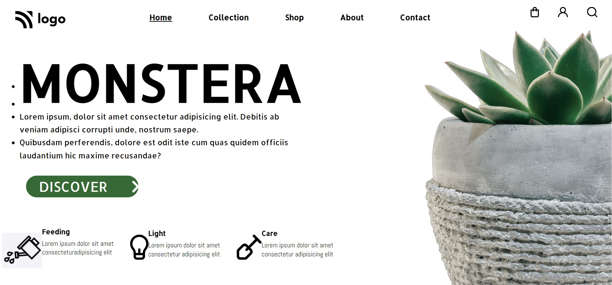

# Assignment 6

 

---

## Project 6 [Live link]()
- Skills Gained in this project
    - Learned css postions.
    - Learned about image positioning and allignments.
    
---

## Time taken to finish this project

- 2.5 hour taken to Finish this project.

Screenshot

